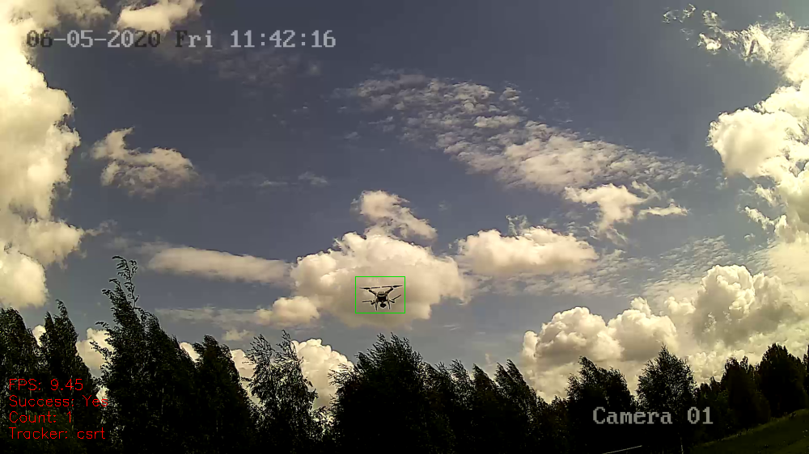

# Нахождение дронов на видео

## Документация

В папке проекта после `venv/Scripts/activate.bat` выполнить

`>python -m pydoc -p 331`

Документация будет доступна по адресу: http://localhost:331

---

## Папка **test_video**

https://drive.google.com/drive/folders/1nZNIsMh_c6lci8_yOeuPsb9hxv9oZToR?usp=sharing

---

## Детекция и трекинг объектов на видео

### Запуск

`>python -m detection_tracking_video --video test_video/any/car_evening.mp4 --tracker csrt --saving_videos False`

### Параметры

* `-v`, `--video` - Путь к видео - **Обязательный праметр**
* `-t`, `--tracker` - Название трекера. Возможные значения "csrt", "kcf", "boosting", "mil", "tld", "medianflow", "mosse". По умолчанию *kcf*.
* `-sv`, `--saving_videos` - Сохранять видео. Возможные значения *True  / False*. По умолчанию *False*; Сохранено будет в папке saving.

### Клавиши

* `s` - Сохранить кадр; Сохранено будет в папке saving.
* `a` - Добавить объект для трекинга; Выбрать с помощью мыши объект, нажать `enter`.
* `x` - Изменить область одного из объектов трекинга; Выбрать с помощью мыши объект, нажать `enter`.
* `z` - Очистить и обновить объекты трекинга.
* `d` - Удалить трекинг для всех объектов из выделенной области; Выбрать с помощью мыши объект, нажать `enter`.
* `c` - Удалить трекинг для всех объектов.
* `f` - Выбрать/изменить зону слежения.
* `g` - Добавить зону исключения.

## Пример работы программы

---

## Нахождение движущихся объектов на видео

### Запуск

`>python -m processing_video -v test_video/any/car_evening.mp4`

### Параметры

* `-v`, `--video` - Путь к видео - **Обязательный праметр**
* `-shm`, `--showing_mask` - Показать маску изображения. Возможные значения *True  / False*. По умолчанию *False*.
* `-sv`, `--saving_videos` - Сохранять видео. Возможные значения *True  / False*. По умолчанию *False*; Сохранено будет в папке saving.

### Сохранить кадр

Нажать клавишу `s`; Сохранено будет в папке saving.

### Выход

Нажать клавишу `Esc` или закрыть окно.

## Пример работы программы

---

## Трекинг объектов на видео

### Запуск

`>python -m tracking_video --video test_video/any/car_evening.mp4 --tracker csrt`

### Параметры

* `-v`, `--video` - Путь к видео - **Обязательный праметр**
* `-t`, `--tracker` - Название трекера. Возможные значения "csrt", "kcf", "boosting", "mil", "tld", "medianflow", "mosse". По умолчанию *kcf*.

### Выбрать объект для трекинга

Нажать клавишу `a`; Выбрать с помощью мыши объект, нажать `enter`.

### Сохранить кадр

Нажать клавишу `s`; Сохранено будет в папке saving.

### Выход

Нажать клавишу `Esc` или закрыть окно.

## Пример работы программы

После инциализации

Трекинг

Объект "потерялся"

